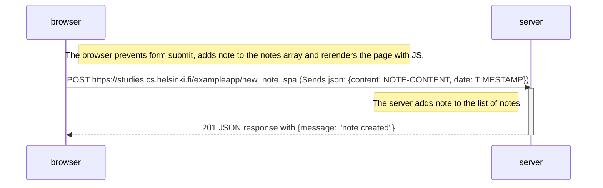

```mermaid
sequenceDiagram
    participant browser
    participant server

    Note right of browser: The browser prevents form submit, adds note to the notes array and rerenders the page with JS.

    browser->>server: POST https://studies.cs.helsinki.fi/exampleapp/new_note_spa (Sends json: {content: NOTE-CONTENT, date: TIMESTAMP})
    activate server

    Note left of server: The server adds note to the list of notes

    server-->>browser: 201 JSON response with {message: "note created"}
    deactivate server
```
